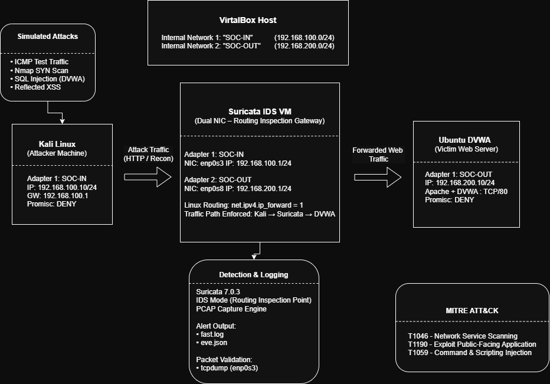

# Network Architecture Overview

## Objective

This lab implements a dual-network Suricata IDS architecture to simulate real-world traffic inspection.

All attacker traffic is forced through a dedicated inspection node before reaching the target system.

The goal is to:

- Simulate attacker-to-victim traffic
- Force inline traffic inspection
- Validate packet capture and logging
- Detect reconnaissance and web exploitation attacks
- Generate structured alerts for analysis

---

## Architecture Diagram

> The diagram illustrates attacker-to-victim traffic flow through the Suricata inspection node.

---

## Lab Components

### 1. Kali Linux (Attacker)
- Performs reconnaissance (Nmap, TCP scans)
- Launches SQL Injection and XSS attacks
- Sends ICMP and HTTP traffic

### 2. Suricata IDS (Inspection Node)
- Dual network interfaces
- Acts as inline inspection point
- Monitors ingress and egress traffic
- Generates alerts in:
  - `fast.log`
  - `eve.json`

### 3. Ubuntu (DVWA Server)
- Hosts Damn Vulnerable Web Application (DVWA)
- Acts as victim machine
- Receives malicious HTTP payloads

---

## Network Segmentation

The lab uses two isolated internal networks:

### SOC-IN Network
- Connects Kali → Suricata (Ingress Interface)

### SOC-OUT Network
- Connects Suricata → Ubuntu (Egress Interface)

Suricata bridges both networks by enabling IP forwarding, ensuring all traffic is inspected before reaching the target.

---

## Traffic Flow

